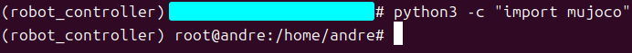

# 1.2 System Requirements

## Purpose

This section describes the software and hardware environment required to run MuJoCo simulation, the hardware controller, the SDK, and external algorithms.

## Recommended Environment

| Scenario | Recommended system | Architecture | Notes |
| --- | --- | --- | --- |
| Local simulation and development | Ubuntu 20.04 or later | x86_64 | Used for MuJoCo, SDK, and external-algorithm verification |
| E15 / RK3588 hardware side | Ubuntu 20.04 | aarch64 / arm64 | Uses `bin_rk3588/` and `lib_rk3588/` |
| Y15 / x86 hardware side | Ubuntu 16.04 | x86_64 | Uses `bin/` and `lib/` |

## Software Dependencies

| Dependency | Purpose | Recommended installation |
| --- | --- | --- |
| Conda / Python 3.8 | Simulation, LCM tools, external algorithms | `bash scripts/setup_conda_env.sh` |
| LCM | Controller, SDK, simulation, and external-algorithm communication | `sudo apt-get install liblcm-dev` or helper script |
| MuJoCo | Physics simulation and visualization | `pip install mujoco==3.2.3` |
| ONNX Runtime | Run RL policy models | `pip install onnxruntime` |
| CMake / Make / GCC | Build controller and SDK | `bash scripts/check_cmake_make_gcc.sh` or system package manager |

## First-Time Setup

Install Anaconda or Miniconda before running setup scripts: https://www.anaconda.com/products/distribution


After installation, create and activate the simulation/tool Conda environment `robot_controller`:

```bash
bash scripts/setup_conda_env.sh
conda activate robot_controller
```

If Python LCM bindings are missing, for example `import lcm` fails, install them:

```bash
bash scripts/install_python_lcm.sh
```

If multi-machine communication fails or local LCM messages cannot be received, configure LCM multicast/networking only when needed:

```bash
sudo bash scripts/setup_lcm_network.sh
```

## Success Criteria

1. In the `robot_controller` Conda environment, `python3 -c "import mujoco"` exits without error.



2. In the same environment, `python3 -c "import lcm"` exits without error.


3. `bash scripts/monitor_lcm.sh --no-gui` can start.


4. C++ SDK examples can be built under `yobotics_sdk/build/`.

## Safety Note

Hardware operation depends on more than the software environment. Before running, also confirm the battery, emergency stop, IMU, SPI devices, network interface, multicast route, and configuration file against the actual site hardware.
