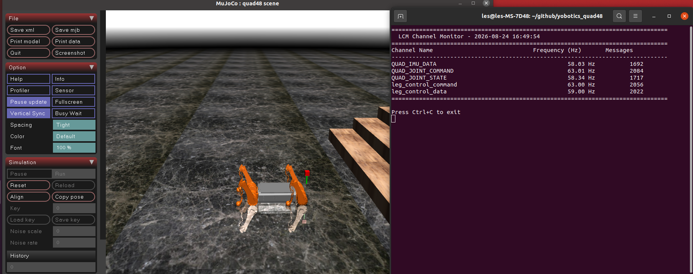

# 2.2 Start Simulation

## Purpose

This section explains how to start the MuJoCo simulator and controller and verify that the base environment, model assets, and LCM communication are available.

## Prerequisites

- A Python environment is activated, for example `conda activate robot_controller`.
- `config_sim.yaml` exists and contains `simulation.enable_mujoco: true`.
- `resources/`, `mujoco_sim/`, and the controller executable exist.
- Simulation must use `config_sim.yaml`; do not use `config.yaml`.

## Steps

Run from the project root:

```bash
bash scripts/start_mujoco.sh --config config_sim.yaml
```

MuJoCo simulation startup screen:


View script parameters:

```bash
bash scripts/start_mujoco.sh --help
```


## Script Behavior

`scripts/start_mujoco.sh` performs these actions:

1. Checks whether the configuration file exists.
2. Checks whether `simulation.enable_mujoco` is `true`.
3. Sets `PYTHONPATH` and `YBT_CONFIG_FILE`.
4. Starts `python3 -m mujoco_sim.mujoco_simulator`.
5. Finds and starts the controller.
6. Cleans up simulator and controller processes when `Ctrl+C` is pressed.

## Success Criteria

- The terminal shows MuJoCo simulator and controller startup information.
- Viewer opens normally without startup errors.
- The controller keeps running without missing assets, missing libraries, or Python import failures.


- `bash scripts/monitor_lcm.sh --no-gui` shows LCM messages.



## Troubleshooting

| Symptom | Common cause | Action |
| --- | --- | --- |
| MuJoCo not enabled | The configuration file is not the simulation configuration | Use `config_sim.yaml` and confirm `simulation.enable_mujoco: true` |
| Viewer cannot open | No graphical environment or OpenGL issue | Use a desktop environment |
| Controller not found | Not built or distribution package is incomplete | Check `build/user/YBT_Controller/ybt_ctrl` and `bin/ybt_ctrl` |
| No LCM messages | LCM network or Python LCM problem | Run `bash scripts/monitor_lcm.sh --no-gui` |
