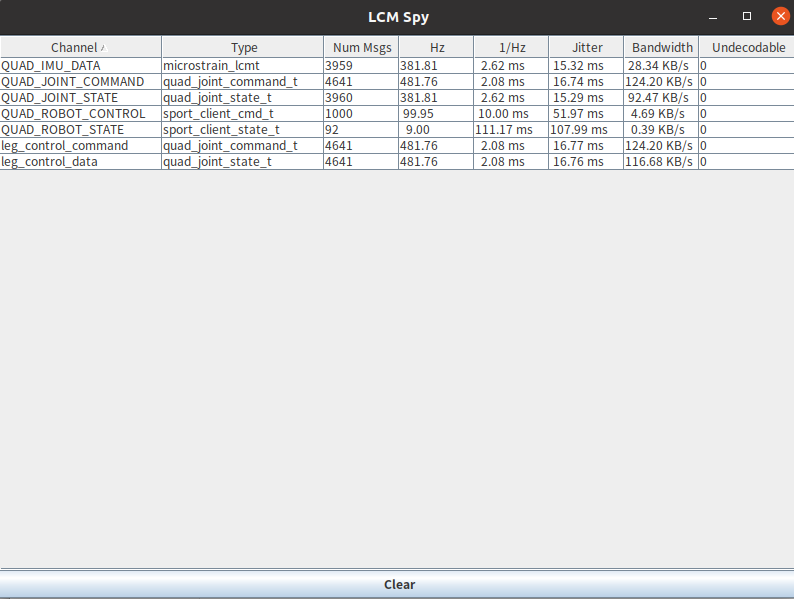
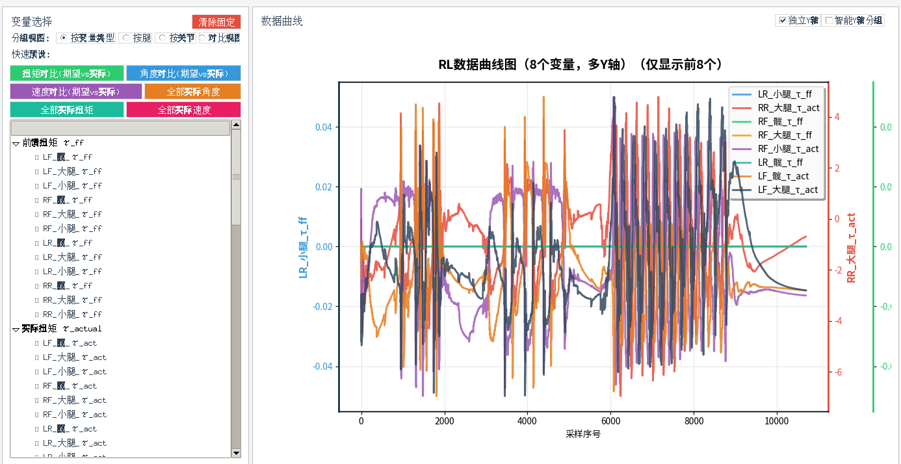

# 2.4 Simulation Debugging

## Purpose

This section covers common LCM monitoring, controller logs, MuJoCo Viewer, CSV data, and plotting tools used during MuJoCo simulation.

## LCM Monitor

View all channels and frequencies:

```bash
bash scripts/monitor_lcm.sh
```


Use text mode in an environment without GUI:

```bash
bash scripts/monitor_lcm.sh --no-gui
```


Specify an LCM URL:

```bash
bash scripts/monitor_lcm.sh --lcm-url "udpm://239.255.76.67:7667?ttl=255"
```

You can also use the official LCM tool:

```bash
bash scripts/launch_lcm_spy.sh
```



If multi-machine communication fails or local machines in the same LAN cannot receive LCM messages while the remote robot can send and receive normally, run:

```bash
sudo bash scripts/setup_lcm_network.sh
```

## Controller Logs

Default log path:

```text
log/robot_log.txt
```

View recent logs:

```bash
tail -n 80 log/robot_log.txt
```

Follow logs in real time:

```bash
tail -f log/robot_log.txt
```

Logging switches are in `config_sim.yaml`:

```yaml
logging:
  enable_logging: True
  log_file_path: "log/robot_log.txt"
```

## MuJoCo Viewer

In a normal graphical environment, `start_mujoco.sh` starts Viewer. Viewer can be used to observe robot posture, contact state, and abnormal motion.

## CSV Data and Simulation Plotting

Normal RL data viewing:

```bash
python3 scripts/data_viewer.py
python3 scripts/data_viewer.py log/log_RL_walk_data.csv
```



Related switches are usually in:

```yaml
rl_walk:
  enable_logging: false
  log_file_path: "log/log_RL_walk_data.csv"

rl_run:
  enable_logging: false
  log_file_path: "log/log_RL_run_data.csv"
```

## Troubleshooting

| Symptom | Action |
| --- | --- |
| LCM monitor has no data | Check whether simulator and controller are running and whether the LCM URL matches |
| CSV file does not exist | Confirm that the corresponding logging switch is enabled and rerun |
| Viewer freezes or shows a black screen | Reproduce in headless mode, then check OpenGL environment |
| Abnormal spikes in plotted data | Recheck model parameters, action scale, PD parameters, and joint order |
