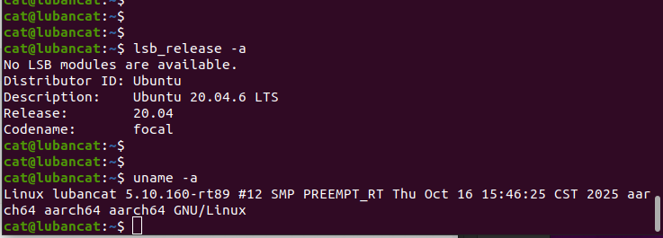

# 3.1 Hardware Deployment Principles

## Purpose

This section explains what physical deployment and MuJoCo simulation have in common, how they differ, and how to switch between them.

## Shared Logic

Simulation and hardware share these core components:

- Main controller.
- FSM control modes such as `DAMP`, `RECOVERY_STAND`, `RL_WALK`, `RL_RUN`, and `DEVELOPMENT`.
- RL policy models and observation-processing logic.
- SDK / WebRTC / external algorithms sending control or development-mode commands through LCM.
- Safety checks, logging, and configuration loading.

## Differences

| Item | Simulation | Hardware |
| --- | --- | --- |
| Configuration file | `config_sim.yaml` | `config.yaml` |
| MuJoCo switch | `simulation.enable_mujoco: true` | `simulation.enable_mujoco: false` |
| Motor communication | LCM simulation channels | SPI / physical motor communication |
| Data source | MuJoCo joint and IMU data | Real motors, IMU, remote control, sensors |
| Risk | Program or model error | Robot falling, collision, hardware damage, or personal injury |

## Controller Hardware Data Path

After hardware startup, the controller does not choose communication by robot name directly. It initializes layer by layer from the configuration:

```text
config.yaml
    -> FSM_ConfigLoader
    -> RobotRunner::init()
    -> MotorCommunicationInterface
    -> SPI/LCM motor state and commands
```

Simulation uses `config_sim.yaml` with `simulation.enable_mujoco: true`; motor state and commands pass through LCM between the simulation bridge and controller. Hardware uses `config.yaml`; MuJoCo is disabled, SPI devices read real motor state and send motor commands, and the IMU is read by an independent serial driver.

### E15 / Y15 Hardware System Architecture

The following diagrams show the relationship between controller, SPI communication boards, IMU, LCM / SDK, and motors during E15 and Y15 deployment. Device nodes, SPI type, and IMU type must be confirmed on site.

`E15:`




`Y15:`


### What Is an SPI Node

An SPI node is a Linux device file such as `/dev/spidev3.0`. During hardware operation, the controller exchanges data with motor communication boards through two SPI device nodes.

SPI nodes are OS and hardware enumeration results. They are not the robot model and cannot be inferred only from CPU architecture. Wrong node names, node order, or permissions can prevent SPI from opening, and even if SPI opens, wrong mapping can cause abnormal joint state or direction.

Confirm device numbers on the target machine:

```bash
ls -l /dev/spidev*
```

## SPI Differences Between Y15 and E15

Y15 and E15 share the quadruped joint abstraction, two SPI boards, and 12 joint command interfaces, but the raw SPI frame format and joint zero offsets are not exactly the same. `spi_type` selects the protocol branch, read structure, SPI rate, and joint offsets.

Here, Y15/E15 refers to the SPI communication-board type, not an alias for IMU type. The code does not automatically choose HipNuc because `spi_type: E15`, and does not automatically choose Lord because `spi_type: Y15`. IMU selection is independent in the `imu` block.

### Different IMUs on Y15 and E15

Current hardware combinations usually use MicroStrain IMU on Y15 and HipNuc IMU on E15. Their serial protocols, device naming, baud rates, data formats, and quaternion handling differ.

| Robot model | IMU vendor | Code driver | Config value |
| --- | --- | --- | --- |
| Y15 | MicroStrain | `LordImu` / Lord driver | `imu.type: "lord"` |
| E15 | HipNuc | `Imu_data` / HipNuc driver | `imu.type: "hipnuc"` |

Treat hardware combinations and software fields separately. `spi_type` selects motor SPI protocol and joint conversion; `imu.type` selects the IMU vendor driver. The former does not infer the latter.

HipNuc and Lord serial settings cannot be mixed. HipNuc `port_base` should be a full device path; Lord and AHRS usually use a device-name prefix plus `port_number`.

## Simulation-to-Hardware Sequence

1. Verify models, controller, and external algorithms in MuJoCo.
2. Prepare SPI and IMU configuration for the target robot.
3. Send the deployment package to the robot side.
4. Confirm battery, emergency stop, cables, ground, and safety area.
5. Start the controller and move gradually from a safe mode to motion modes.
6. Record logs and observe state with LCM tools during operation.

## Safety Note

Scripts can select `bin/` or `bin_rk3588/` by system architecture, but they cannot identify the real robot model, SPI board type, or IMU serial port automatically. Before running, manually confirm `motor_communication.spi_type`, SPI nodes, and `imu` configuration in `config.yaml` against the actual hardware.
