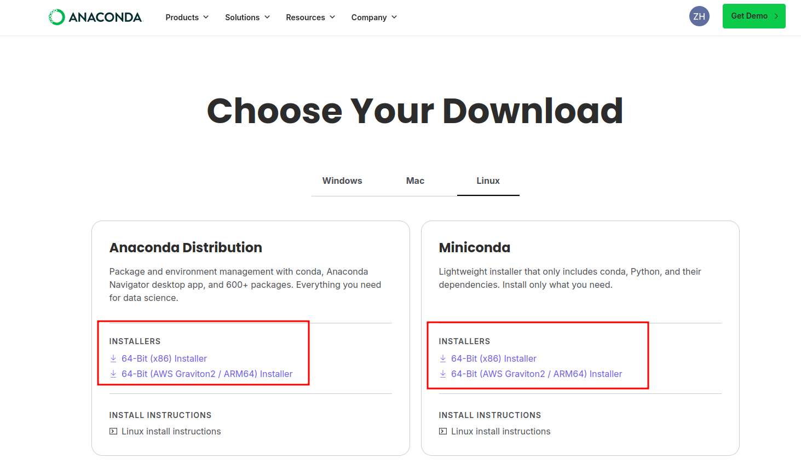
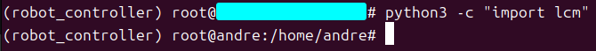

# 1.2 Системные требования

## Назначение

Этот раздел описывает программное и аппаратное окружение, необходимое для запуска симуляции MuJoCo, аппаратного контроллера, SDK и внешних алгоритмов.

## Рекомендуемое окружение

| Сценарий | Рекомендуемая система | Архитектура | Примечания |
| --- | --- | --- | --- |
| Локальная симуляция и разработка | Ubuntu 20.04 или новее | x86_64 | Используется для проверки MuJoCo, SDK и внешних алгоритмов |
| Аппаратная сторона E15 / RK3588 | Ubuntu 20.04 | aarch64 / arm64 | Использует `bin_rk3588/` и `lib_rk3588/` |
| Аппаратная сторона Y15 / x86 | Ubuntu 16.04 | x86_64 | Использует `bin/` и `lib/` |

## Программные зависимости

| Зависимость | Назначение | Рекомендуемая установка |
| --- | --- | --- |
| Conda / Python 3.8 | Симуляция, инструменты LCM, внешние алгоритмы | `bash scripts/setup_conda_env.sh` |
| LCM | Связь контроллера, SDK, симуляции и внешних алгоритмов | `sudo apt-get install liblcm-dev` или вспомогательный скрипт |
| MuJoCo | Физическая симуляция и визуализация | `pip install mujoco==3.2.3` |
| ONNX Runtime | Запуск RL-моделей политик | `pip install onnxruntime` |
| CMake / Make / GCC | Сборка контроллера и SDK | `bash scripts/check_cmake_make_gcc.sh` или системный пакетный менеджер |

## Первичная настройка

Перед запуском скриптов настройки установите Anaconda или Miniconda: https://www.anaconda.com/products/distribution




После установки создайте и активируйте Conda-окружение `robot_controller` для симуляции и инструментов:

```bash
bash scripts/setup_conda_env.sh
conda activate robot_controller
```

Если Python-привязки LCM отсутствуют, например `import lcm` завершается ошибкой, установите их:

```bash
bash scripts/install_python_lcm.sh
```

Если связь между несколькими машинами не работает или локальные сообщения LCM не принимаются, настраивайте multicast/сеть LCM только при необходимости:

```bash
sudo bash scripts/setup_lcm_network.sh
```

## Критерии успешного выполнения

1. В Conda-окружении `robot_controller` команда `python3 -c "import mujoco"` завершается без ошибки.


2. В том же окружении команда `python3 -c "import lcm"` завершается без ошибки.



3. `bash scripts/monitor_lcm.sh --no-gui` запускается.


4. Примеры C++ SDK собираются в `yobotics_sdk/build/`.

## Примечание по безопасности

Работа физического робота зависит не только от программного окружения. Перед запуском также сверьте аккумулятор, аварийную остановку, IMU, SPI-устройства, сетевой интерфейс, multicast-маршрут и конфигурационный файл с фактическим оборудованием площадки.
