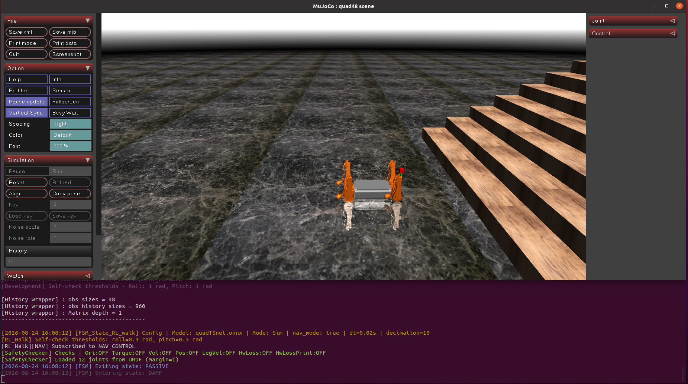

# 2.2 Запуск симуляции

## Назначение

Этот раздел объясняет, как запустить симулятор MuJoCo и контроллер, а также проверить доступность базового окружения, ресурсов модели и связи LCM.

## Предварительные условия

- Python-окружение активировано, например `conda activate robot_controller`.
- `config_sim.yaml` существует и содержит `simulation.enable_mujoco: true`.
- `resources/`, `mujoco_sim/` и исполняемый файл контроллера существуют.
- Симуляция должна использовать `config_sim.yaml`; не используйте `config.yaml`.

## Шаги

Запускайте из корня проекта:

```bash
bash scripts/start_mujoco.sh --config config_sim.yaml
```

Экран запуска симуляции MuJoCo:


Просмотр параметров скрипта:

```bash
bash scripts/start_mujoco.sh --help
```


## Поведение скрипта

`scripts/start_mujoco.sh` выполняет следующие действия:

1. Проверяет, существует ли конфигурационный файл.
2. Проверяет, что `simulation.enable_mujoco` равно `true`.
3. Задает `PYTHONPATH` и `YBT_CONFIG_FILE`.
4. Запускает `python3 -m mujoco_sim.mujoco_simulator`.
5. Находит и запускает контроллер.
6. Очищает процессы симулятора и контроллера при нажатии `Ctrl+C`.

## Критерии успешного выполнения

- Терминал показывает информацию о запуске симулятора MuJoCo и контроллера.
- Viewer открывается нормально, без ошибок запуска.
- Контроллер продолжает работать без отсутствующих ресурсов, отсутствующих библиотек или ошибок импорта Python.



- `bash scripts/monitor_lcm.sh --no-gui` показывает сообщения LCM.


## Устранение неполадок

| Симптом | Типичная причина | Действие |
| --- | --- | --- |
| MuJoCo не включен | Конфигурационный файл не является конфигурацией симуляции | Используйте `config_sim.yaml` и подтвердите `simulation.enable_mujoco: true` |
| Viewer не открывается | Нет графического окружения или проблема OpenGL | Используйте desktop-окружение |
| Контроллер не найден | Не собран или дистрибутивный пакет неполный | Проверьте `build/user/YBT_Controller/ybt_ctrl` и `bin/ybt_ctrl` |
| Нет сообщений LCM | Проблема сети LCM или Python LCM | Запустите `bash scripts/monitor_lcm.sh --no-gui` |
