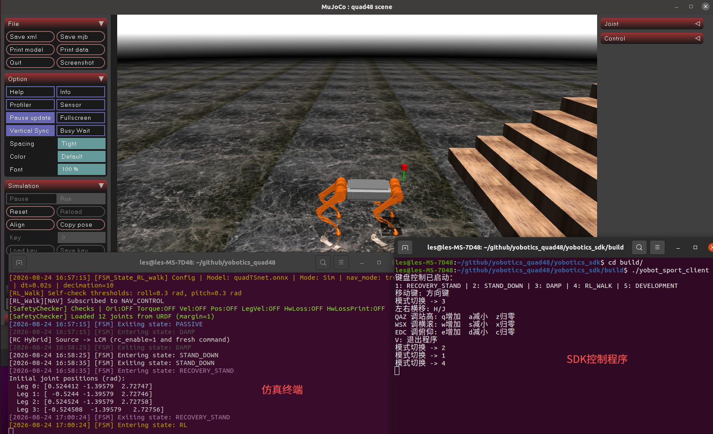

# 2.3 Проверка предустановленных моделей

## Назначение

Этот раздел объясняет, как проверить встроенные предустановленные модели, такие как `RL_WALK` и `RL_RUN`, в MuJoCo.

## Предварительные условия

- Симуляция MuJoCo запущена командой `bash scripts/start_mujoco.sh --config config_sim.yaml`.
- Файлы ONNX-моделей в `actor_model/` присутствуют полностью.
- Пути моделей `rl_walk` и `rl_run`, размерности наблюдений, размерности суставов и параметры управления в `config_sim.yaml` соответствуют моделям.

## Проверяемые пункты

| Пункт | Расположение | Описание |
| --- | --- | --- |
| Путь модели | `rl_walk.model_path`, `rl_run.model_path` в `config_sim.yaml` | Указывает на ONNX-файлы в `actor_model/` |
| Размерность наблюдения | `obs_dim` | Должна соответствовать входу модели |
| Размерность суставов | `dof_dim` | Текущий четвероногий робот использует 12 |
| Масштаб действия | `action_scale` | Влияет на амплитуду выхода политики, преобразуемую в целевые положения суставов |
| PD-параметры | `dof_kp`, `dof_kd` | Влияют на жесткость и демпфирование отслеживания |
| Ограничение момента | `tau_limit` | Предотвращает чрезмерный выход |

## Шаги

1. Запустите симуляцию:

```bash
bash scripts/start_mujoco.sh --config config_sim.yaml
```

2. Используйте SDK или точку входа управления, чтобы переключиться в `RECOVERY_STAND`, затем войдите в `RL_WALK` или `RL_RUN`.


3. Наблюдайте позу, походку и устойчивость робота в MuJoCo Viewer.
4. Одновременно запустите мониторинг LCM:

```bash
bash scripts/monitor_lcm.sh --no-gui
```

5. Чтобы записать RL-данные, временно включите соответствующий переключатель логирования и запустите снова.

## Критерии успешного выполнения

- Модель загружается без ошибок.
- Робот может войти в соответствующий RL-режим из безопасной позы.
- Положение, скорость и момент суставов не показывают аномальных всплесков.
- Каналы LCM продолжают публиковать данные, а журналы контроллера не показывают NaN, Inf или ошибок размерности входа/выхода модели.



## Примечание по безопасности

Если в симуляции появляются тряска, падение, чрезмерное движение или ошибки журнала, не развертывайте эту модель на физическом роботе. Сначала проверьте путь модели, построение наблюдений, порядок суставов, масштаб действия, углы суставов по умолчанию и PD-параметры.
