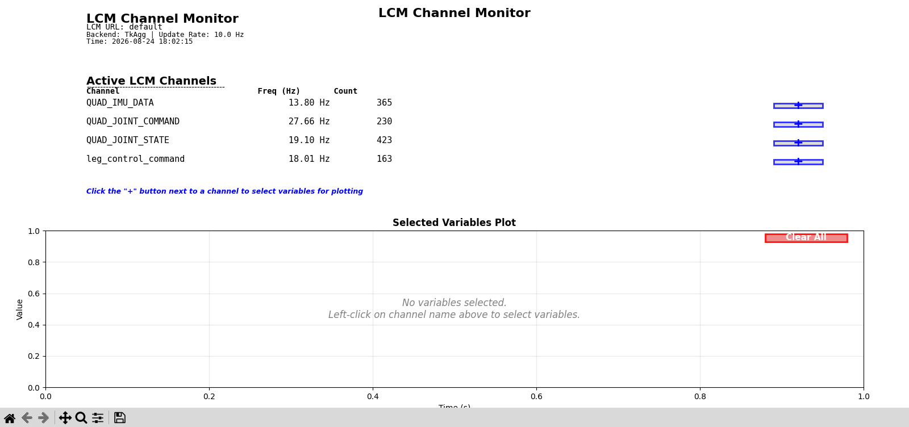
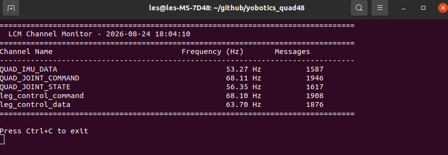

# 2.4 Отладка симуляции

## Назначение

Этот раздел описывает типичный мониторинг LCM, журналы контроллера, MuJoCo Viewer, CSV-данные и инструменты построения графиков, используемые при симуляции MuJoCo.

## Монитор LCM

Просмотр всех каналов и частот:

```bash
bash scripts/monitor_lcm.sh
```



Используйте текстовый режим в окружении без GUI:

```bash
bash scripts/monitor_lcm.sh --no-gui
```



Указать URL LCM:

```bash
bash scripts/monitor_lcm.sh --lcm-url "udpm://239.255.76.67:7667?ttl=255"
```

Также можно использовать официальный инструмент LCM:

```bash
bash scripts/launch_lcm_spy.sh
```


Если связь между несколькими машинами не работает или локальные машины в той же LAN не принимают LCM-сообщения, хотя удаленный робот отправляет и принимает их нормально, выполните:

```bash
sudo bash scripts/setup_lcm_network.sh
```

## Журналы контроллера

Путь журнала по умолчанию:

```text
log/robot_log.txt
```

Просмотр последних записей:

```bash
tail -n 80 log/robot_log.txt
```

Отслеживание журналов в реальном времени:

```bash
tail -f log/robot_log.txt
```

Переключатели логирования находятся в `config_sim.yaml`:

```yaml
logging:
  enable_logging: True
  log_file_path: "log/robot_log.txt"
```

## Просмотрщик MuJoCo

В обычном графическом окружении `start_mujoco.sh` запускает Viewer. Viewer можно использовать для наблюдения за позой робота, состоянием контактов и аномальными движениями.

## CSV-данные и графики симуляции

Обычный просмотр RL-данных:

```bash
python3 scripts/data_viewer.py
python3 scripts/data_viewer.py log/log_RL_walk_data.csv
```


Связанные переключатели обычно находятся здесь:

```yaml
rl_walk:
  enable_logging: false
  log_file_path: "log/log_RL_walk_data.csv"

rl_run:
  enable_logging: false
  log_file_path: "log/log_RL_run_data.csv"
```

## Устранение неполадок

| Симптом | Действие |
| --- | --- |
| В мониторе LCM нет данных | Проверьте, запущены ли симулятор и контроллер, а также совпадает ли URL LCM |
| CSV-файл не существует | Убедитесь, что соответствующий переключатель логирования включен, и запустите снова |
| Viewer зависает или показывает черный экран | Воспроизведите в headless-режиме, затем проверьте окружение OpenGL |
| Аномальные всплески на графиках | Повторно проверьте параметры модели, масштаб действия, PD-параметры и порядок суставов |
