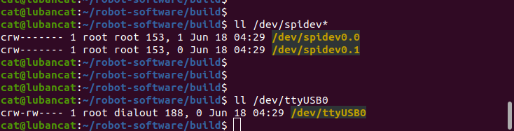
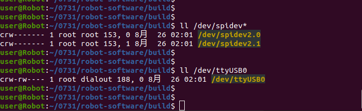

# 3.1 Принципы развертывания на роботе

## Назначение

Этот раздел объясняет, что общего у развертывания на физическом роботе и симуляции MuJoCo, чем они отличаются и как между ними переключаться.

## Общая логика

Симуляция и физический робот используют следующие общие компоненты:

- Основной контроллер.
- Режимы управления FSM, такие как `DAMP`, `RECOVERY_STAND`, `RL_WALK`, `RL_RUN` и `DEVELOPMENT`.
- Модели RL-политик и логика обработки наблюдений.
- SDK / WebRTC / внешние алгоритмы, отправляющие команды управления или команды режима разработки через LCM.
- Проверки безопасности, логирование и загрузка конфигурации.

## Различия

| Пункт | Симуляция | Физический робот |
| --- | --- | --- |
| Конфигурационный файл | `config_sim.yaml` | `config.yaml` |
| Переключатель MuJoCo | `simulation.enable_mujoco: true` | `simulation.enable_mujoco: false` |
| Связь с моторами | Каналы симуляции LCM | SPI / связь с физическими моторами |
| Источник данных | Данные суставов и IMU из MuJoCo | Реальные моторы, IMU, пульт управления, датчики |
| Риск | Ошибка программы или модели | Падение робота, столкновение, повреждение оборудования или травма |

## Аппаратный путь данных контроллера

После аппаратного запуска контроллер не выбирает связь напрямую по имени робота. Он инициализируется послойно из конфигурации:

```text
config.yaml
    -> FSM_ConfigLoader
    -> RobotRunner::init()
    -> MotorCommunicationInterface
    -> SPI/LCM motor state and commands
```

Симуляция использует `config_sim.yaml` с `simulation.enable_mujoco: true`; состояние моторов и команды проходят через LCM между bridge симуляции и контроллером. Физический робот использует `config.yaml`; MuJoCo отключен, SPI-устройства читают реальные состояния моторов и отправляют моторные команды, а IMU читается независимым serial-драйвером.

### Архитектура аппаратной системы E15 / Y15

Следующие схемы показывают связь контроллера, плат SPI-связи, IMU, LCM / SDK и моторов при развертывании E15 и Y15. Узлы устройств, тип SPI и тип IMU нужно подтвердить на месте.

`E15:`




`Y15:`




### Что такое SPI-узел

SPI-узел — это файл устройства Linux, например `/dev/spidev3.0`. Во время работы физического робота контроллер обменивается данными с платами связи моторов через два SPI-узла.

SPI-узлы являются результатом перечисления устройств операционной системой и аппаратной платформой. Это не модель робота, и их нельзя вывести только из архитектуры CPU. Неверные имена узлов, порядок узлов или права доступа могут помешать открытию SPI; даже если SPI откроется, неправильное сопоставление может вызвать аномальное состояние или направление суставов.

Проверьте номера устройств на целевой машине:

```bash
ls -l /dev/spidev*
```

## Различия SPI между Y15 и E15

Y15 и E15 используют общую абстракцию суставов четвероногого робота, две SPI-платы и 12 интерфейсов команд суставов, но raw-формат SPI-кадра и нулевые смещения суставов отличаются. `spi_type` выбирает ветку протокола, структуру чтения, скорость SPI и смещения суставов.

Здесь Y15/E15 обозначает тип платы SPI-связи, а не псевдоним типа IMU. Код не выбирает HipNuc автоматически из-за `spi_type: E15` и не выбирает Lord автоматически из-за `spi_type: Y15`. Выбор IMU независим и задается в блоке `imu`.

### Разные IMU на Y15 и E15

Текущие аппаратные комбинации обычно используют MicroStrain IMU на Y15 и HipNuc IMU на E15. Их serial-протоколы, имена устройств, скорости передачи, форматы данных и обработка кватернионов различаются.

| Модель робота | Производитель IMU | Драйвер в коде | Значение конфигурации |
| --- | --- | --- | --- |
| Y15 | MicroStrain | `LordImu` / Lord driver | `imu.type: "lord"` |
| E15 | HipNuc | `Imu_data` / HipNuc driver | `imu.type: "hipnuc"` |

Рассматривайте аппаратные комбинации и программные поля отдельно. `spi_type` выбирает SPI-протокол моторов и преобразование суставов; `imu.type` выбирает драйвер производителя IMU. Первое не определяет второе.

Serial-настройки HipNuc и Lord нельзя смешивать. Для HipNuc `port_base` должен быть полным путем устройства; Lord и AHRS обычно используют префикс имени устройства плюс `port_number`.

## Последовательность перехода от симуляции к роботу

1. Проверьте модели, контроллер и внешние алгоритмы в MuJoCo.
2. Подготовьте конфигурацию SPI и IMU для целевого робота.
3. Передайте пакет развертывания на сторону робота.
4. Проверьте аккумулятор, аварийную остановку, кабели, поверхность и безопасную зону.
5. Запустите контроллер и постепенно переходите из безопасного режима к режимам движения.
6. Во время работы записывайте журналы и наблюдайте состояние инструментами LCM.

## Примечание по безопасности

Скрипты могут выбрать `bin/` или `bin_rk3588/` по архитектуре системы, но не могут автоматически определить реальную модель робота, тип SPI-платы или serial-порт IMU. Перед запуском вручную сверьте `motor_communication.spi_type`, SPI-узлы и конфигурацию `imu` в `config.yaml` с фактическим оборудованием.
