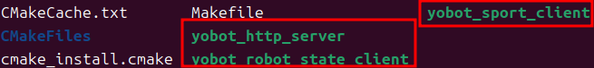

# 4.2 Сборка SDK

## Назначение

Этот раздел объясняет, как собрать `yobotics_sdk/` и сгенерировать примеры программ управления движением, чтения состояния и HTTP-сервиса.

## Предварительные условия

- CMake, Make, GCC / G++ установлены.
- Система может найти библиотеку LCM.
- Текущий каталог является корнем проекта.

## Шаги сборки

```bash
cd yobotics_sdk
mkdir -p build
cd build
cmake ..
make -j4
```

## Сгенерированные программы

Основные программы после успешной сборки:

```text
yobotics_sdk/build/yobot_sport_client
yobotics_sdk/build/yobot_robot_state_client
yobotics_sdk/build/yobot_http_server
```

## Необязательная переменная окружения

По умолчанию SDK использует стандартный адрес LCM. Чтобы задать другой:

```bash
export YOBOTICS_LCM_URL="udpm://239.255.76.67:7667?ttl=255"
```

Используйте `ttl=255` для управления между машинами. Сохраняйте один и тот же URL для контроллера, симуляции, SDK и внешних алгоритмов.

Проверьте переменную окружения LCM:

```bash
echo $YOBOTICS_LCM_URL
```


## Критерии успешного выполнения

- `cmake ..` находит LCM.


- `make -j4` завершается без ошибок сборки.


- `build/` содержит `yobot_sport_client`, `yobot_robot_state_client` и `yobot_http_server`.



## Устранение неполадок

| Симптом | Действие |
| --- | --- |
| LCM не найден | Установите `liblcm-dev` или проверьте путь установки LCM |
| Программа запускается, но не получает состояние | Проверьте, запущен ли контроллер и совпадает ли URL LCM |
| Управление между машинами не работает | Проверьте UDP multicast, firewall и multicast-маршруты |
