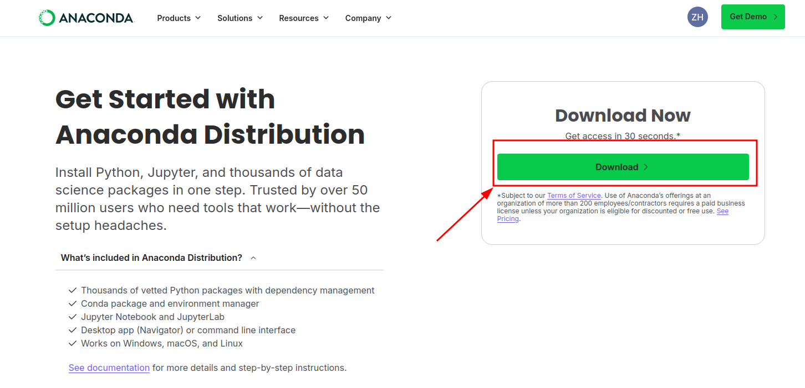
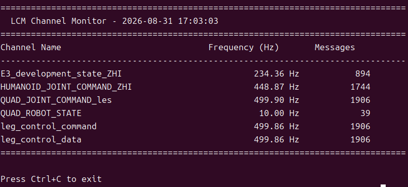

# 1.2 系统要求

## 用途

本节说明运行 MuJoCo 仿真、实物控制器、SDK 和外部算法所需的软硬件环境。

## 推荐环境

| 场景 | 推荐系统 | 架构 | 说明 |
| --- | --- | --- | --- |
| 本地仿真与开发 | Ubuntu 20.04 及以上 | x86_64 | 用于 MuJoCo、SDK、外部算法验证 |
| E15 / RK3588 实物端 | Ubuntu 20.04  | aarch64 / arm64 | 使用 `bin_rk3588/` 和 `lib_rk3588/` |
| Y15 / x86 实物端 | Ubuntu 16.04 | x86_64 | 使用 `bin/` 和 `lib/` |

## 软件依赖

| 依赖 | 用途 | 推荐安装方式 |
| --- | --- | --- |
| Conda / Python 3.8 | 仿真、LCM 工具、外部算法 | `bash scripts/setup_conda_env.sh` |
| LCM | 控制器、SDK、仿真和外部算法通信 | `sudo apt-get install liblcm-dev` 或脚本安装 |
| MuJoCo | 物理仿真与可视化 | `pip install mujoco==3.2.3` |
| ONNX Runtime | 运行 RL 策略模型 | `pip install onnxruntime` |
| CMake / Make / GCC | 编译控制器和 SDK | `bash scripts/check_cmake_make_gcc.sh` 或系统包管理器安装 |

## 初次配置
执行脚本之前，需要安装 Anaconda 或 Miniconda（https://www.anaconda.com/products/distribution ）  




下载安装完成后：

先创建并激活仿真 / 工具用的 conda 环境 `robot_controller`：

```bash
bash scripts/setup_conda_env.sh
conda activate robot_controller
```

如果 Python 侧缺少 LCM 绑定（例如 `import lcm` 失败），再补装 Python LCM：

```bash
bash scripts/install_python_lcm.sh
```

如果多机通信或本机收不到 LCM 消息，再配置 LCM 多播 / 网卡相关网络（会改系统网络，仅在需要时执行）：

```bash
sudo bash scripts/setup_lcm_network.sh
```

## 成功标志

（1）robot_controller conda 环境下，执行`python3 -c "import mujoco"` 无报错。


（2）robot_controller conda 环境下，执行`python3 -c "import lcm"` 无报错。


（3）`bash scripts/monitor_lcm.sh --no-gui` 可以启动。



（4）C++ SDK 可以在 `yobotics_sdk/build/` 下编译生成示例程序(详细编译步骤见1.4章节)。

## 安全提示

实物运行不只依赖软件环境。运行前还必须确认机器人电池、急停、IMU、SPI 设备、网卡、多播路由和配置文件都与现场设备一致。
