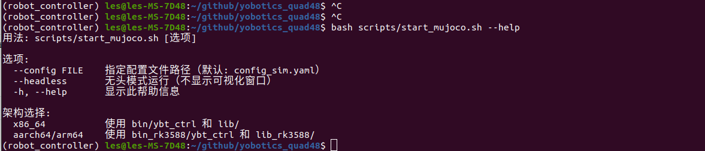

# 2.2 启动仿真

## 用途

本节说明如何启动 MuJoCo 仿真器和控制器，确认基础环境、模型资源和 LCM 通信可用。

## 前提

- 已激活 Python 环境，例如 `conda activate robot_controller`（环境配置见1.2章节）。
- `config_sim.yaml` 存在，并且 `simulation.enable_mujoco: true`。
- `resources/`、`mujoco_sim/` 和控制器可执行文件存在。
- 仿真必须用 config_sim.yaml，不要用 config.yaml。

## 操作步骤

在项目根目录运行：

```bash
bash scripts/start_mujoco.sh --config config_sim.yaml
```
MuJoCo 仿真启动界面


查看脚本参数：

```bash
bash scripts/start_mujoco.sh --help
```

## 脚本行为

`scripts/start_mujoco.sh` 会完成以下操作：

1. 检查配置文件是否存在。
2. 检查 `simulation.enable_mujoco` 是否为 `true`。
3. 设置 `PYTHONPATH` 和 `YBT_CONFIG_FILE`。
4. 启动 `python3 -m mujoco_sim.mujoco_simulator`。
5. 查找并启动控制器。
6. 按 `Ctrl+C` 时清理仿真器和控制器进程。


## 成功标志
- 终端显示 MuJoCo 仿真器和控制器启动信息。
- Viewer 正常打开，无启动错误。
- 控制器持续运行，没有资源缺失、库缺失或 Python 导入失败。

- `bash scripts/monitor_lcm.sh --no-gui` 能看到 LCM 消息。


## 常见问题

| 现象 | 常见原因 | 处理 |
| --- | --- | --- |
| 提示 MuJoCo 未启用 | 配置文件不是仿真配置 | 使用 `config_sim.yaml` 并确认 `simulation.enable_mujoco: true` |
| Viewer 打不开 | 无图形环境或 OpenGL 异常 | 请使用桌面端 |
| 找不到控制器 | 未编译或分发包不完整 | 检查 `build/user/YBT_Controller/ybt_ctrl`、`bin/ybt_ctrl` |
| 没有 LCM 消息 | LCM 网络或 Python LCM 异常 | 运行 `bash scripts/monitor_lcm.sh --no-gui` 排查 |
