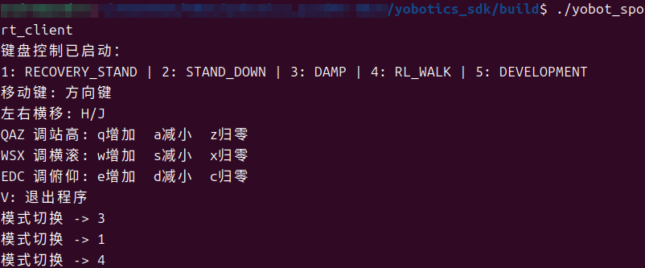

# 2.3 验证预部署模型

## 用途

本节说明如何在 MuJoCo 中验证软件包内置的 `RL_WALK`、`RL_RUN` 等预部署模型。

## 前提

- MuJoCo 仿真已通过 `bash scripts/start_mujoco.sh --config config_sim.yaml` 启动。
- `actor_model/` 中的 ONNX 模型文件完整。
- `config_sim.yaml` 中 `rl_walk`、`rl_run` 的模型路径、观测维度、关节维度和控制参数匹配模型。

## 检查项

| 检查项 | 位置 | 说明 |
| --- | --- | --- |
| 模型路径 | `config_sim.yaml` 的 `rl_walk.model_path`、`rl_run.model_path` | 指向 `actor_model/` 下的 ONNX 文件 |
| 观测维度 | `obs_dim` | 必须与模型输入一致 |
| 关节维度 | `dof_dim` | 当前四足机器人为 12 |
| 动作缩放 | `action_scale` | 影响策略输出到关节目标的幅值 |
| PD 参数 | `dof_kp`、`dof_kd` | 影响跟踪刚度和阻尼 |
| 扭矩限制 | `tau_limit` | 防止输出过大 |

## 操作步骤

1. 启动仿真：

```bash
bash scripts/start_mujoco.sh --config config_sim.yaml
```

2. 使用 SDK 或控制入口切换到 `RECOVERY_STAND`，再进入 `RL_WALK` 或 `RL_RUN`。

3. 观察 MuJoCo Viewer 中机器人姿态、步态和稳定性。
4. 同时开启 LCM 监控：

```bash
bash scripts/monitor_lcm.sh --no-gui
```

5. 如需记录 RL 数据，临时打开对应日志开关后重新运行(见2.4章节)。

## 成功标志

- 模型加载无报错。
- 机器人能从安全姿态进入对应 RL 模式。
- 关节位置、速度和力矩没有异常尖峰。
- LCM 通道持续输出，控制器日志没有 NaN、Inf、模型输入输出维度错误。


## 安全提示

仿真中发现抖动、摔倒、动作过大或日志报错时，不要将该模型部署到实物。先核对模型路径、观测构造、关节顺序、动作缩放、默认关节角和 PD 参数，验证通过后可通过3.1～3.3章节进实物；有异常见2.4章节调试。
