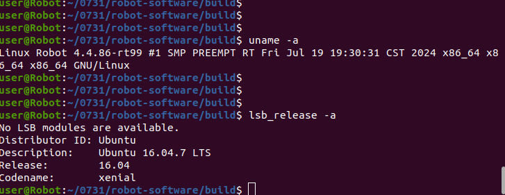

# 3.1 实物部署原理

## 用途

本节说明实物部署和 MuJoCo 仿真的相同点、区别和切换原则。

## 相同点

仿真和实物共用以下核心逻辑：

- 主控制器。
- FSM 控制模式，例如 `DAMP`、`RECOVERY_STAND`、`RL_WALK`、`RL_RUN`、`DEVELOPMENT`。
- RL 策略模型和观测处理逻辑。
- SDK / WebRTC / 外部算法通过 LCM 发送控制或开发模式命令。
- 安全检查、日志和配置加载流程。

## 区别

| 项目 | 仿真 | 实物 |
| --- | --- | --- |
| 配置文件 | `config_sim.yaml` | `config.yaml` |
| MuJoCo 开关 | `simulation.enable_mujoco: true` | `simulation.enable_mujoco: false` |
| 电机通信 | LCM 仿真通道 | SPI / 实物电机通信 |
| 数据来源 | MuJoCo 关节和 IMU 数据 | 真实电机、IMU、遥控器、传感器 |
| 风险 | 程序或模型错误 | 机器人摔倒、撞击、硬件损坏或人员受伤 |

## 控制器硬件数据链路

实物启动后，控制器不是直接根据机器人名称选择通信方式，而是按配置逐层初始化：

```text
config.yaml
    -> FSM_ConfigLoader
    -> RobotRunner::init()
    -> MotorCommunicationInterface
    -> SPI/LCM 电机状态与命令
```


仿真使用 `config_sim.yaml`：`simulation.enable_mujoco: true`，电机状态和命令通过 LCM 在仿真桥与控制器之间传递。实物使用 `config.yaml`：关闭 MuJoCo，由 SPI 设备读取真实电机状态并下发命令；IMU 则由独立的串口驱动读取。

### E15 / Y15 实物系统架构示意

下图用于说明 E15 和 Y15 实物部署时，控制器、SPI 通信板、IMU、LCM / SDK 和电机之间的整体关系。不同机型的设备节点、SPI 类型和 IMU 类型需要以现场配置为准。

`E15:`


`Y15:`




### SPI 节点是什么

SPI 节点指 Linux 系统暴露出的 SPI 设备文件，例如 `/dev/spidev3.0`。实物运行时，控制程序通过两个 SPI 设备节点与电机通信板交换数据，读取电机状态并下发电机命令。

SPI 节点属于操作系统和硬件枚举结果，不等于机器人型号，也不能只根据 CPU 架构推断。节点名称、节点顺序或权限错误时，可能导致 SPI 无法打开；即使 SPI 能打开，设备映射错误仍可能造成关节状态和方向异常。

控制器通过配置中的 `spi_device0` 和 `spi_device1` 选择两个 SPI 板。具体设备号应在目标机器上确认：

```bash
ls -l /dev/spidev*
```


## Y15 与 E15 的 SPI 差异

Y15 和 E15 共用四足机器人关节抽象、两个 SPI 板和 12 个关节命令接口，但 SPI 原始帧格式和关节零点并不完全相同。`spi_type` 用于选择协议分支、读取结构、SPI 速率和关节偏置。


这里的 Y15/E15 是 SPI 通信板类型，不是 IMU 类型的别名。项目代码不会因为 `spi_type: E15` 自动选择 HipNuc，也不会因为 `spi_type: Y15` 自动选择 Lord；IMU 由 `imu` 配置块单独选择。

### Y15 和 E15 使用不同 IMU

当前项目的实际硬件组合是：Y15 使用 MicroStrain 厂商 IMU，E15 使用 HipNuc 厂商 IMU。两类 IMU 的串口协议、设备命名、波特率、数据格式和四元数处理方式不同，因此控制器不能用同一个读取类直接兼容。

| 机型 | IMU 厂商 | 代码驱动 | 配置值 |
| --- | --- | --- | --- |
| Y15 | MicroStrain | `LordImu` / Lord 驱动 | `imu.type: "lord"` |
| E15 | HipNuc | `Imu_data` / HipNuc 驱动 | `imu.type: "hipnuc"` |

硬件组合和软件字段的关系要区分开：当前产品通常是 Y15 + MicroStrain、E15 + HipNuc，但代码仍把 `spi_type` 和 `imu.type` 作为两个独立配置项。`spi_type` 选择电机 SPI 协议和关节转换，`imu.type` 选择 IMU 厂商驱动；前者不会自动推导后者。

无论使用哪家 IMU，驱动最终都会把加速度、四元数和角速度转换到统一的数据结构。后续状态估计、FSM 和安全检查只使用统一数据，不需要知道底层厂商。


HipNuc 和 Lord 的串口配置不能混用。例如 hipnuc 的 port_base 应是完整设备路径；lord 和 ahrs 通常把 port_base 写成设备名前缀，再由 port_number 拼接最终设备名。

## 从仿真到实物的运行时序

1. 在 MuJoCo 中完成模型、控制器和外部算法验证。
2. 根据目标机型准备对应的 SPI 和 IMU 配置。
3. 将部署包发送到机器人端。
4. 确认电池、急停、线缆、地面和安全区域。
5. 启动控制器，并从安全模式逐步进入运动模式。
6. 运行中记录日志并使用 LCM 工具观察状态。

SPI 设备号、IMU 串口号、Y15/E15 配置示例和启动日志属于操作性内容，统一放在 3.2 配置章节中。

## 安全提示

脚本可以根据系统架构选择 `bin/` 或 `bin_rk3588/`，但不能自动判断机器人真实型号、SPI 板类型或 IMU 串口。运行前必须人工确认 `config.yaml` 中 `motor_communication.spi_type`、SPI 设备节点和 `imu` 配置与实物一致。设备节点是现场 Linux 枚举结果，不应只根据 CPU 架构或机器人名称猜测。
