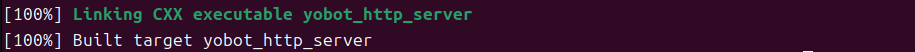

# 4.2 SDK 编译流程

## 用途

本节说明如何编译 `yobotics_sdk/`，生成运动控制、状态读取和 HTTP 服务示例程序。

## 前提

- 已安装 CMake、Make、GCC / G++。
- 系统可找到 LCM 库。
- 当前位于项目根目录。

## 编译步骤

```bash
cd yobotics_sdk
mkdir -p build
cd build
cmake ..
make -j4
```

## 生成程序

编译成功后常用程序位于：

```text
yobotics_sdk/build/yobot_sport_client
yobotics_sdk/build/yobot_robot_state_client
yobotics_sdk/build/yobot_http_server
```

## 可选环境变量

SDK 默认使用 LCM 默认地址。如需指定地址：

```bash
export YOBOTICS_LCM_URL="udpm://239.255.76.67:7667?ttl=255"
```
跨机控制用 ttl=255；与控制器、仿真、外部算法保持同一 URL。
查看LCM环境变量是否设置成功
```bash
echo $YOBOTICS_LCM_URL
```

SDK、控制器、仿真器和外部算法需要使用相同的 LCM URL，

## 成功标志

- `cmake ..` 能找到 LCM。

- `make -j4` 无编译错误。


- `build/` 下生成 `yobot_sport_client`、`yobot_robot_state_client`、`yobot_http_server`。
 
## 常见问题

| 现象 | 处理 |
| --- | --- |
| 找不到 LCM | 安装 `liblcm-dev`，或检查 LCM 安装路径 |
| 程序运行但收不到状态 | 检查控制器是否运行、LCM URL 是否一致 |
| 异机控制失败 | 检查 UDP 组播、防火墙和多播路由 |
