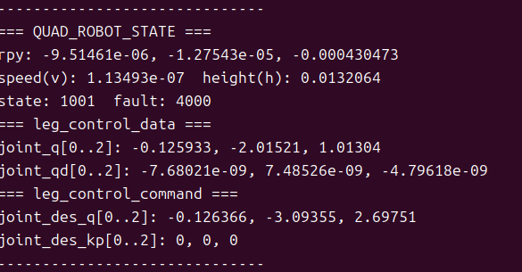

# 4.5 SDK 控制仿真例子

## 用途

本节说明如何用 SDK 控制 MuJoCo 仿真，适合作为高层二次开发的第一步验证。

## 前提

- MuJoCo 仿真可启动。
- SDK 已编译完成。
- SDK 与仿真器、控制器使用同一个 LCM URL。

## 操作步骤

### 1. 启动仿真（终端窗口1）

```bash
# 如果mujoco安装在conda环境下,先从base切到conda环境,再执行下方脚本
conda env list 
conda activate robot_controller
```

```bash
bash scripts/start_mujoco.sh --config config_sim.yaml
```

### 2. 监控 LCM（终端窗口2）

```bash
bash scripts/monitor_lcm.sh --no-gui
```

```bash
# 如果lcm安装在conda环境下,先从base切到conda环境,再执行上方脚本
conda env list 
conda activate robot_controller
```
### 3. 运行 SDK 运动控制（终端窗口3）

```bash
cd yobotics_sdk/build
./yobot_sport_client
```

### 4. 运行 SDK 状态读取（终端窗口4）

另开一个终端：

```bash
cd yobotics_sdk/build
./yobot_robot_state_client
```

## 成功标志

- MuJoCo Viewer 中机器人对 SDK 命令有响应，如能从趴/阻尼到站立再走动。
- `monitor_lcm.sh` 能看到 `QUAD_ROBOT_CONTROL` 和 `QUAD_ROBOT_STATE`。
- 状态读取示例输出随控制命令变化。

## 常见问题

| 现象 | 处理 |
| --- | --- |
| SDK 命令无响应 | 确认控制器已进入可接收高层命令的模式 |
| 状态读取为空 | 确认 LCM URL 和状态通道一致 |
| 仿真摔倒 | 降低速度命令并检查模型、PD 参数和动作限幅 |

## 安全提示

虽然仿真不会损坏实物，但仿真中的异常动作通常代表配置或模型存在问题。不要跳过问题直接上实物。
